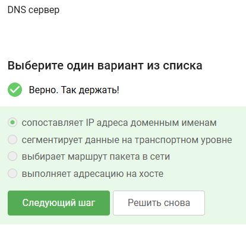
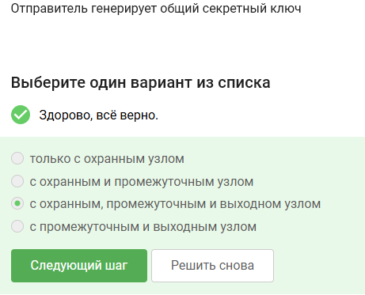

Answers to test assignments presented in the first section of the course "Fundamentals of Cybersecurity"

<!--more-->

# Work Objective

Выполнить первый раздел внешнего курса "Основы кибербезопасности".

# Task

Первый раздел курса "Основы кибербезопасности".

# Theoretical Introduction

Теоретическое введение в курсе представлено в виде видео-лекций.

# Completing the Work

HTTPS is an application layer protocol

The TCP protocol operates at the transport layer

The other options contain values greater than 255, which is incorrect

A DNS server maps IP addresses to domain names. The other options do not fit

The correct sequence of protocols in the TCP/IP model: application -- transport -- network -- link layer

The HTTP protocol implies data transmission between client and server in plain text

HTTP consists of two phases: handshake and data transfer

The TLS protocol version is determined by both the client and the server during the "negotiation" process

During the TLS handshake phase, data encryption is not provided

Cookies store the session ID and user identifier

Cookies are not used to improve connection reliability

Cookies are generated by the server

Session cookies are stored in the browser for the duration of using the website

In the TOR onion network, there are 3 intermediate nodes

The other options are not suitable

The sender generates a shared secret key with the guard, intermediate, and exit node	

No, the recipient does not need to use the TOR browser to receive packets

WiFi is a wireless local area network technology (IEEE 802.11)

WiFi operates at the link layer

WEP is an insecure method of providing encryption and authentication in WiFi networks	

Data between a network host and the router is transmitted in encrypted form after device authentication

Personal - for individuals, Enterprise - for organizations

# Conclusions

We completed the first section of the course "Fundamentals of Cybersecurity".
