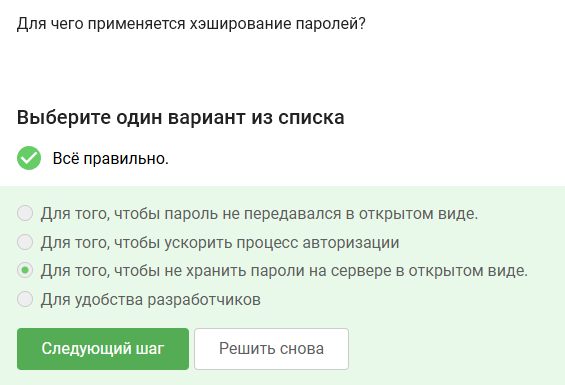
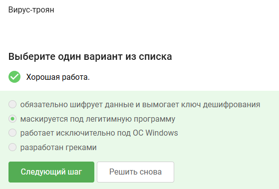

Answers to test assignments presented in the second section of the course "Fundamentals of Cybersecurity"

<!--more-->

# Objective of the work

Complete the second section of the external course "Fundamentals of Cybersecurity".

# Task

Second section of the course "Fundamentals of Cybersecurity".

# Theoretical Introduction

The theoretical introduction in the course is presented in the form of video lectures.

# Completing the Work

The boot sector of a disk can be encrypted.

Disk encryption is based on symmetric encryption.

A hard disk can be encrypted using VeraCrypt and BitLocker software.

The remaining passwords are simple; they don't even use special characters or mixed case letters.

Passwords should only be stored securely in password managers.

CAPTCHA is needed to protect against automated attacks.

Password hashing is used to avoid storing passwords on the server in plain text—that is, for security purposes.

Salt will not help improve password resistance to brute-force attacks.

All proposed measures protect against data leaks from brute-force attacks.

Correct answers: sberbank.ru, yandex.ru, without anything extra in between.

Yes, address spoofing is possible.

Email spoofing is the forgery of the sender's address in emails.

A Trojan virus disguises itself as a legitimate program.

It is formed during the generation of the first message by the sending party.

The essence of end-to-end encryption is that messages are transmitted through communication nodes in encrypted form.

# Conclusions

We completed the second section of the external course "Fundamentals of Cybersecurity" and learned about phishing, email spoofing, and other related concepts.
