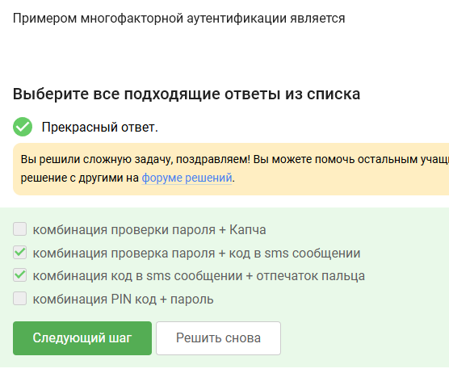
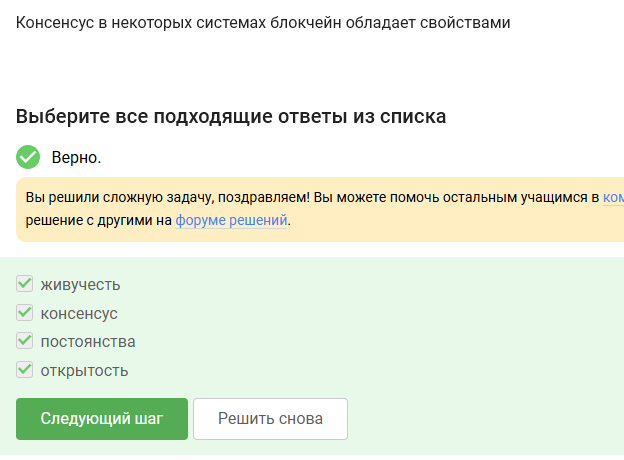

Answers to test assignments presented in the third section of the course "Fundamentals of Cybersecurity"

<!--more-->

# Objective of the work

Complete the third section of the external course "Fundamentals of Cybersecurity".

# Task

Third section of the course "Fundamentals of Cybersecurity".

# Theoretical Introduction

The theoretical introduction in the course is presented in the form of video lectures.

# Completing the Work

In asymmetric cryptographic primitives, both parties have a key pair.

A cryptographic hash function does not ensure confidentiality of hashed data, while the other answer options are correct.

RSA, ECDSA, and GOST R 34.10-2012 are digital signature algorithms.

Diffie-Hellman key exchange is an asymmetric primitive for generating a shared secret key.

The electronic digital signature verification algorithm requires as input: signature, secret key, and message.

Electronic digital signature does not ensure confidentiality.

To submit tax reports to the Federal Tax Service, an enhanced qualified electronic signature is required.

A qualified certificate for an electronic signature verification key can be obtained at a certification authority.

MasterCard and MIR are payment systems.

Password check + SMS code and SMS code + fingerprint are two examples of multi-factor authentication.

Today, multi-factor authentication of the buyer is used before the issuing bank for online payments. 

A correct property is the difficulty of finding a preimage.

Consensus in some blockchain systems has all the properties proposed in the assignment.

Blockchain participants store secret digital signature keys.

# Conclusions

We completed the third section of the external course "Fundamentals of Cybersecurity" and learned more about secret keys, digital signatures, and blockchain.
