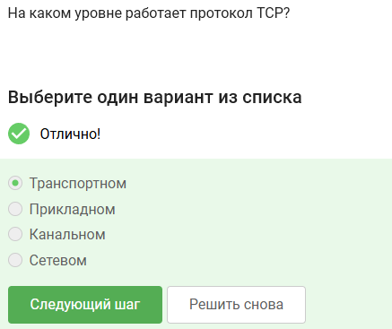
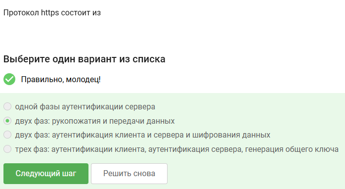
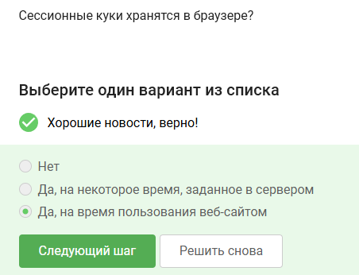
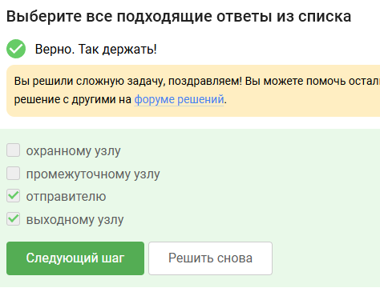
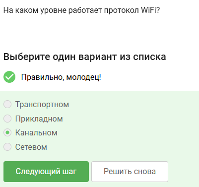

Ответы на тестовые задания представленные в первом разделе курса "Основы кибербезопасности"

<!--more-->

# Цель работы

Выполнить первый раздел внешнего курса "Основы кибербезопасности".

# Задание

Первый раздел курса "Основы кибербезопасности".

# Теоретическое введение

Теоретическое введение в курсе представлено в виде видео-лекций.

# Выполнение лабораторной работы

HTTPS - протокол прикладного уровня

Протокол TCP работает на траснпортном уровне

В остальных есть значения больше 255, что неправильно

DNS сервер сопопставляет IP адреса доменным именам. Остальное не подходит

Корректная поледовательность протоколов в модели TCP/IP: прикладной -- транспортный -- сетевой -- канальный

Протокол http предпологает передачу данных между клиентом и сервером в открытом виде

HTTP состоит из двух фаз: рукопожатия и передачи данных

Версия протокола TLS определяется как клиентом, так и сервером в процессе "переговоров"

В фазе рукопожатия TLS не предусмотрено шифрование данных

Куки хранят id сессии и идентификатор пользователя

Куки не используются для улучшения надежности соединения

Куки генерируются сервером

Сессионные куки хранятся в браузере на время пользования веб-сайтом

В луковой сети TOR 3 промежуточных узла

Остальные варианты не подходят

Отправитель генерирует общий секретный ключ с охранным, промежуточным и выходном узлом

Нет, получатель не должен использовать браузер TOR для получения пакетов

WiFI - это технология беспроводной локальной сети (IEEE 802.11)

WiFi работает на канальном уровне

WEP - небезопасный метод обеспечения шифрования и аутентификации в сети WiFi

Данные между хостом сети и роутером передаются в зашифрованном виде после аутентификации устройств

Personal - персональный, enterprise - для компаний

# Выводы

Мы выполнили первый раздел курса "Основы кибербезопасности".	
