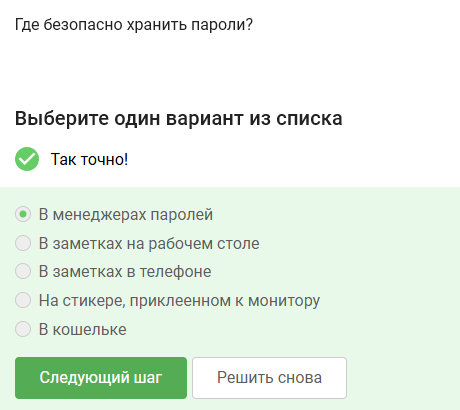
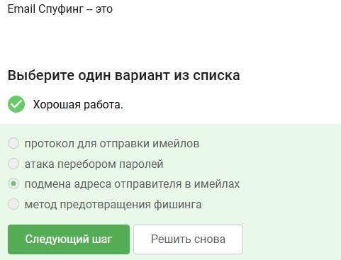
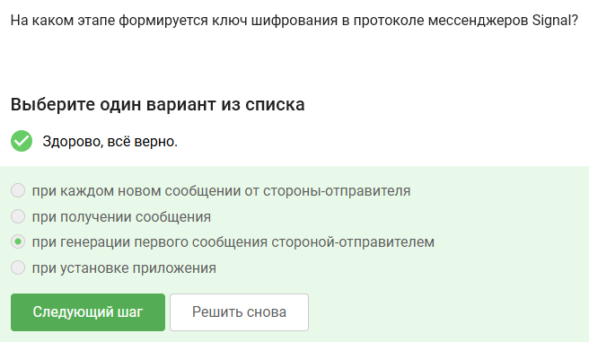
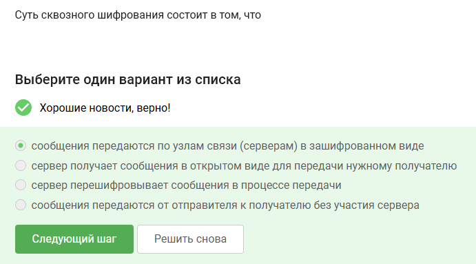

Ответы на тестовые задания представленные в втором разделе курса "Основы кибербезопасности"

<!--more-->

# Цель работы

Выполнить второй раздел внешнего курса "Основы кибербезопасности".

# Задание

Второй раздел курса "Основы кибербезопасности".

# Теоретическое введение

Теоретическое введение в курсе представлено в виде видео-лекций.

# Выполнение лабораторной работы

Загрузочный сектор диска можно зашифровать

Шифрование диска основано на симметричном шифровании

Жесткий диск можно зашифровать с помощью программ VeraCrypt и BitLocker

Остальный пароли простые, даже не используют спецсимволы и разные регистры

Пароли безопасно хранить только в менеджерах паролей

Капча нужна для защиты от автоматизированных атак

Хэширование паролей применяется для того, чтобы не хранить пароли на сервере в открытом виде, то есть для безопасности

Соль не поможет для улучшения стойкости паролей к атаке перебором

Все предложенные меры защищают от утечек данных атакой перебором

Правильные: sberbank.ru, yandex.ru, без чего-то дополнительного между

Да, может быть подмена адресса

Email Спуфинг - это подмена адреса отправителя в имейлах

Вирус троян маскируется под легитимную программу

Формируется при генерации первого сообщения стороной-отправителем

Суть сквозного шифрования состоит в том, что сообщения передаются по узлам связи в зашифрованном виде

# Выводы

Мы выполнили второй раздел внешнео курса "Основы кибербезопасности", изучили что такое фишинг, Email Спуфинг и другое.
