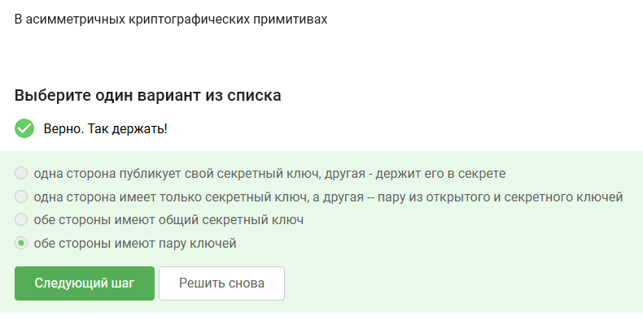
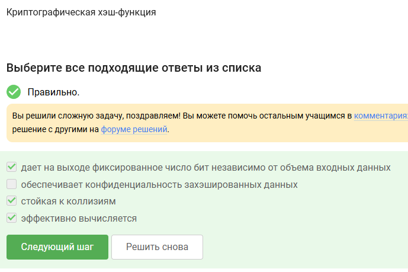
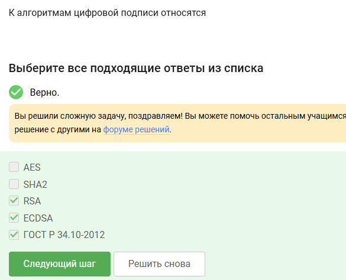
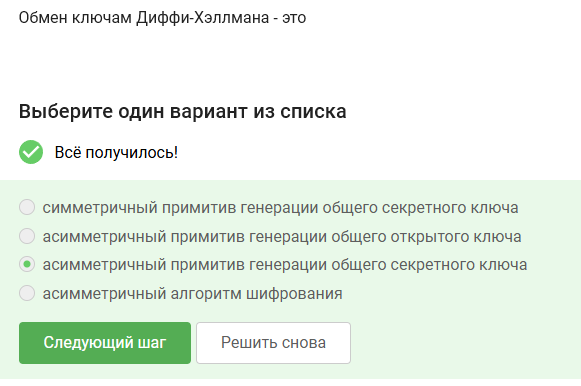

Ответы на тестовые задания представленные в первом разделе курса "Основы кибербезопасности"

<!--more-->

# Цель работы

Выполнить третий раздел внешнего курса "Основы кибербезопасности".

# Задание

Третий раздел курса "Основы кибербезопасности".

# Теоретическое введение

Теоретическое введение в курсе представлено в виде видео-лекций.

# Выполнение лабораторной работы

В ассиметрических криптографических примитивах обе стороны имеют пару ключей

Криптографическая хэш-функция не обеспечивает конфидециальность захэшированных данных, а остальные варианты ответа подходят

К алгоритмам цифровой подписи относятся RSA, ECDSA и ГОСТ Р 34.10-2012

Обмен ключами Диффи-Хэллмана - это ассимитричный примитив генерации общего секретного ключа

Алгоритм верификации электронной цифровой подписи требует на вход подпись, секретный ключ, сообщение

Электронная цифровая подпись не обеспечивает конфиденциальность

Для отправки налоговой отчетности в ФНС понадобится усиленная квалифицированная электронная подпись

В сертификационном центре можно получить квалифицированный сертификат ключа проверки электронной подписи

Платежными системами являются MasterCard и МИР

Проверка пароля + код в СМС и код в СМС + отпечаток пальца - два примера многофакторной аутентификации

Сегодня используется многофакторная аутентификация покупателя перед банком-эмитентом при онлайн платежах

Верное свойство - сложность нахождения прообраза

Консенсус в некоторых системах блокчейн обладает всеми предложенными в задании свойствами

Участники блокчейна хранят секретные ключи цифровой подписи

# Выводы

Мы выполнили третий раздел внешнего курса "Основы кибербезопасности", узнали больше про секретные ключи, цифровые подписи и блокчейн.
